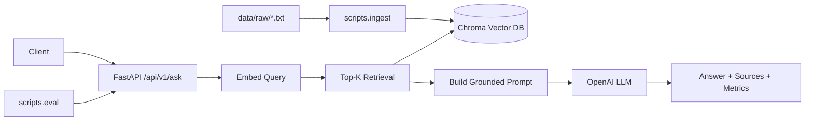

# MLOps Project 2 — Production-Style RAG / LLM System

This project implements a complete **end-to-end Retrieval-Augmented Generation (RAG) workflow**, taking a document corpus from:

**Ingestion → Chunking → Embeddings → Vector Database (Chroma) → Retrieval → LLM Answering → API Serving → Logging/Tracing → Evaluation → Docker → CI**

It is designed to imitate how modern production-grade LLM systems are built.

---

# Features

This project includes:

- **Document ingestion pipeline** from `data/raw/`
- **Deterministic text chunking**
- **OpenAI embeddings** (`text-embedding-3-small`, 1536-dim)
- **Chroma vector database with persistent storage**
- **Top-K similarity retrieval with source attribution**
- **Context-grounded LLM answer synthesis**
- **Structured logging with trace IDs and latency metrics**
- **Evaluation harness for grounding + performance validation**
- **Dockerized API service**
- **Pytest test suite**
- **GitHub Actions CI pipeline**
- **Embedding compatibility guard to prevent dimension mismatch**
- **Operational reset controls (`RESET_COLLECTION`, `COLLECTION_NAME`)**

---

# How to Run Locally

## 1. Create virtual environment & install dependencies

```bash
python3.11 -m venv .venv
source .venv/bin/activate
pip install -r requirements.txt
```

---

## 2. Configure environment variables

```bash
cp .env.example .env
```

Set at minimum:

```env
OPENAI_API_KEY=YOUR_KEY_HERE
```

Optional recommended defaults:

```env
OPENAI_BASE_URL=https://api.openai.com/v1
OPENAI_MODEL=gpt-4.1-mini
EMBEDDING_MODEL=text-embedding-3-small
VECTOR_DB_DIR=vectorstore/chroma
COLLECTION_NAME=documents
RESET_COLLECTION=false
```

---

## 3. Ingest documents

Place `.txt` files into `data/raw/`, then run:

```bash
python -m scripts.ingest
```

This performs:

- **Document loading**
- **Text chunking**
- **Embedding generation**
- **Vector persistence with embedding metadata**

---

## 4. Run the FastAPI service

```bash
uvicorn app.main:app --reload --port 8000
```

Health check:

```bash
curl http://127.0.0.1:8000/api/v1/health
```

Ask a question:

```bash
curl -X POST "http://127.0.0.1:8000/api/v1/ask" \
  -H "Content-Type: application/json" \
  -d '{"question":"What does the internal knowledge base contain?","top_k":2}'
```

---

## 5. Run evaluation harness

```bash
python -m scripts.eval
```

Outputs:

- **Pass/fail validation**
- **Latency metrics**
- **Grounding checks**
- **Per-stage timing (retrieve + LLM)**

---

# Run with Docker

## Build image

```bash
docker build -t rag-llm-system:latest .
```

## Run container

```bash
docker run --rm -p 8000:8000 --env-file .env rag-llm-system:latest
```

## Run with persistent vector store

```bash
docker run --rm \
  -p 8000:8000 \
  --env-file .env \
  -v "$(pwd)/vectorstore/chroma:/app/vectorstore/chroma" \
  rag-llm-system:latest
```

---

# Architecture Overview

This project follows a **production-style RAG architecture** with dedicated components for:

- **Offline ingestion**
- **Persistent vector storage**
- **Similarity-based retrieval**
- **Grounded LLM response generation**
- **API serving**
- **Observability and tracing**
- **Evaluation and validation**
- **CI automation**

---

## High-Level Architecture Diagram



---

# Components

## Ingestion
- **Loads raw documents**
- **Generates embeddings**
- **Stores embedding metadata**
- **Supports safe collection reset**

## Retrieval
- **Query embedding**
- **Top-K similarity search**
- **Context-grounded prompt construction**

## Serving
- **FastAPI application**
- **Trace ID per request**
- **Latency instrumentation**

## CI
- **GitHub Actions workflow**
- **Automated test execution**
- **Docker build validation**

---

# What I Learned / Skills Demonstrated

## LLM Engineering
- Designing **end-to-end RAG systems**
- Implementing **vector similarity search**
- Enforcing **grounded LLM responses**

## Software Engineering
- Building **modular API services**
- Implementing **observability instrumentation**
- Enforcing **configuration safety guards**

## DevOps / CI/CD
- **Dockerized deployment**
- **Persistent vector storage**
- **CI automation via GitHub Actions**

---

# Project Status

- RAG pipeline implemented  
- Vector persistence operational  
- Retrieval + LLM answering functional  
- Logging and metrics implemented  
- Evaluation harness operational  
- Docker deployment working  
- CI pipeline functional  
- Documentation complete  

---

# End of File